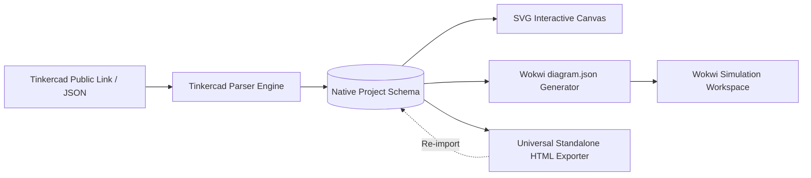

# TCAD-WOKWI-Translator Technical Documentation

Welcome to the technical documentation for **TCAD-WOKWI-Translator**, an open-source, client-side web application designed to bridge Autodesk Tinkercad Circuits with Wokwi, while offering an independent visual breadboard circuit viewer, editor, and standalone universal HTML exporter.

---

## Architecture Overview

TCAD-WOKWI-Translator is designed around five architectural pillars:
1. **Zero-Dependency Vanilla Stack**: Built entirely using pure HTML5, CSS3, and standard ECMAScript modules—no Webpack, Vite, React, or third-party node runtime dependencies.
2. **Client-Side Data Transformation**: All conversions (Tinkercad JSON -> Native JSON -> Wokwi `diagram.json`) happen entirely within the user's browser without requiring server-side rendering or backend data storage.
3. **Interactive Breadboard Canvas**: An SVG/Canvas-driven workspace supporting standard 0.1-inch breadboard grid alignment, jumper wire routing with bend points, and basic electronic components.
4. **Universal Standalone HTML Export**: Projects can be bundled into a single self-contained `.html` file that encapsulates the inline styles, lightweight rendering engine, and project JSON in a single package that opens in any browser and can be re-imported into the editor.
5. **Offline PWA Engine**: Powered by a Service Worker (`sw.js`) with cache-first static asset delivery for offline work in classrooms, maker spaces, and field robotics labs.

---

## Table of Contents
- [Architecture Overview](#architecture-overview)
- [System Pipeline](#system-pipeline)
- [Data Schemas](#data-schemas)
  - [1. Native Circuit Schema](#1-native-circuit-schema)
  - [2. Tinkercad Ingestion Schema](#2-tinkercad-ingestion-schema)
  - [3. Wokwi diagram.json Specification](#3-wokwi-diagramjson-specification)
- [Module Directory Structure](#module-directory-structure)
- [Rendering Engine & Grid Math](#rendering-engine--grid-math)
- [Standalone Universal HTML Specification](#standalone-universal-html-specification)
- [PWA & Offline Service Worker](#pwa--offline-service-worker)
- [Version History](#version-history)

---

## System Pipeline



1. **Ingestion**: The user pastes a public Tinkercad circuit link, drops an exported JSON payload, or starts from scratch.
2. **Parsing & Normalization**: The parser resolves Tinkercad component GUIDs into standard component definitions (Arduino Uno, Half/Full Breadboards, Resistors, LEDs, Potentiometers, Sensors) and extracts breadboard pin coordinates.
3. **Workspace Editing**: The SVG renderer displays the interactive breadboard view with snap-to-hole guidance, wire color customization, and component rotation.
4. **Target Compilation**:
   - **Wokwi**: Compiles components and connections into Wokwi's `diagram.json` syntax with parts definitions and wiring tuples (`[ "partId:pin", "targetId:pin", "color", [ "v0", "h0" ] ]`).
   - **Universal HTML**: Packages a zero-dependency HTML file containing embedded SVG layout and state script.

---

## Data Schemas

### 1. Native Circuit Schema
The internal state is preserved in a clean, JSON-serializable structure:

```json
{
  "metadata": {
    "title": "Smart Street Light with LDR",
    "version": "1.0.0",
    "createdAt": "2026-09-11T14:50:00.000Z",
    "modifiedAt": "2026-09-11T14:50:00.000Z",
    "author": "Open Source Maker"
  },
  "viewport": {
    "zoom": 1.0,
    "panX": 0,
    "panY": 0
  },
  "components": [
    {
      "id": "arduino_uno_1",
      "type": "arduino-uno",
      "x": 80,
      "y": 140,
      "rotation": 0,
      "properties": {}
    },
    {
      "id": "breadboard_half_1",
      "type": "breadboard-half",
      "x": 420,
      "y": 120,
      "rotation": 0,
      "properties": {}
    }
  ],
  "connections": [
    {
      "id": "wire_1",
      "from": { "component": "arduino_uno_1", "pin": "5V" },
      "to": { "component": "breadboard_half_1", "pin": "power_pos_1" },
      "color": "#ef4444",
      "bends": []
    }
  ]
}
```

### 2. Tinkercad Ingestion Schema
Tinkercad circuit payloads contain visual coordinate matrices and component definitions. The ingestion engine extracts:
- `components`: Extracted from Tinkercad schematic / board objects with geometric transforms.
- `nets`: Wire segments with designated RGB colors and terminal coordinate anchors.

### 3. Wokwi `diagram.json` Specification
The Wokwi generator converts normalized circuit instances into standard Wokwi project layouts:
```json
{
  "version": 1,
  "author": "TCAD-WOKWI-Translator",
  "editor": "wokwi",
  "parts": [
    { "type": "wokwi-arduino-uno", "id": "uno", "top": 100, "left": 60, "attrs": {} },
    { "type": "wokwi-breadboard-half", "id": "bb1", "top": 80, "left": 360, "attrs": {} }
  ],
  "connections": [
    [ "uno:5V", "bb1:tp.1", "red", [ "v20", "h40" ] ]
  ]
}
```

---

## Module Directory Structure

```text
TCAD-WOKWI-Translator/
├── index.html               # Main application markup and user interface
├── manifest.json            # PWA manifest
├── sw.js                    # Service worker offline caching
├── README.md                # Project landing page and quick start
├── AGENTS.md                # Development rules and guidelines
├── css/
│   └── style.css            # Dark/sky-blue responsive styling
├── js/
│   ├── app.js               # Application bootstrap and global lifecycle
│   ├── schema.js            # Schemas, defaults, and pinout definitions
│   ├── translator.js        # Tinkercad <-> Native <-> Wokwi translation pipelines
│   ├── renderer.js          # SVG breadboard canvas rendering engine
│   └── ui.js                # Toolbar, drag-and-drop, modals & changelog loader
└── doc/
    ├── versions.md          # Detailed changelog & version history
    ├── DOCUMENTATION.md     # System architecture and technical docs
    ├── idea/                # Concept briefs and background prompts
    └── prompts/             # Dual-written prompt sessions, plans, and walkthroughs
```

---

## Rendering Engine & Grid Math

The workspace is mapped to standard **0.1-inch (2.54 mm)** breadboard pitch converted into pixels (defaulting to 10px or 12px grid units):
- **Grid Snap Unit**: `GRID_SIZE = 12` (configurable).
- **Coordinate Transformation**:
  $$\text{snapX} = \text{round}(x / \text{GRID\_SIZE}) \times \text{GRID\_SIZE}$$
  $$\text{snapY} = \text{round}(y / \text{GRID\_SIZE}) \times \text{GRID\_SIZE}$$
- **Wires**: Rendered as smooth SVG cubic bezier paths (`d="M x1,y1 C cx1,cy1 cx2,cy2 x2,y2"`) with customizable colors, droop physics simulation, and selectable control points.

---

## Standalone Universal HTML Specification

When the user selects **Export > Standalone HTML**, the application bundles:
1. Minified inline CSS tokens and layout.
2. Lightweight SVG rendering logic.
3. The project JSON state encapsulated in `<script id="tcad-circuit-data" type="application/json">...</script>`.
4. Interactive pan/zoom viewer controls.

Opening this HTML file in any browser displays the circuit without internet access. Dragging the file back into TCAD-WOKWI-Translator restores the editable state.

---

## PWA & Offline Service Worker

The application utilizes a cache-first Service Worker (`sw.js`). Line 5 declares the synchronized cache identifier:
```javascript
const CACHE_VERSION = 'v0.1.11';
```
When offline, all static assets (`index.html`, CSS, JS, manifest, versions) are served immediately from the Cache Storage API via a Network-First strategy with offline fallback.

---

## Version History

- **v0.1.0 to v0.1.11 (2026-09-11)**: Resolved Wokwi export `UI.openModal` TypeError with dedicated modal helper methods. Redesigned mobile responsive layout with bottom expanding Floating Action Menu (FAB) and restored GitHub, Docs, and Changelog icons directly in the mobile top header for rapid 1-tap navigation. Optimized mobile touch tap-hold-and-drag interactions via `touch-action: none`, `e.preventDefault()`, and multi-touch 2-finger pinch-to-zoom. Synchronized offline cache to `v0.1.11`.


